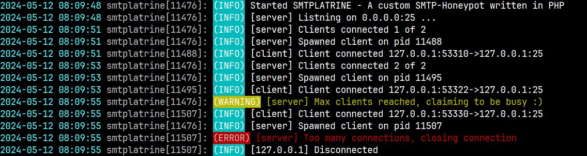

# ᵔᴥᵔ SMTPLATRINE 📦 CONTRIBS

> **THIS DIRECTORY CONTAINS SMALL CONTRIB's TO EASE THE USE OF SMTPLATRINE**

## Table of contents

<!-- TOC -->

- [ᵔᴥᵔ SMTPLATRINE 📦 CONTRIBS](#%E1%B5%94%E1%B4%A5%E1%B5%94-smtplatrine--contribs)
    - [Table of contents](#table-of-contents)
    - [Filess](#filess)
    - [Multitail smtplatrine custom log color scheme! :D](#multitail-smtplatrine-custom-log-color-scheme-d)
        - [What to expect ?](#what-to-expect-)
        - [How to use](#how-to-use)
    - [Systemd - Setup smtplatrine step by step](#systemd---setup-smtplatrine-step-by-step)
        - [Installation steps](#installation-steps)
        - [Check to see if it's running](#check-to-see-if-its-running)
    - [Notes](#notes)
        - [Graphical/Layout contraints](#graphicallayout-contraints)

<!-- /TOC -->

---

## Files(s)

Click any file to go to it directly.

| Filename | Description |
|------:|:------|
| [.multitailrc](.multitailrc) | This is a file for MultiTail with smtplatrine color scheme :)
| [monitor_git_graph.sh](monitor_git_graph.sh) | Script to display GIT Graph visualizing your work while working! |
| [monitor_listner.sh](monitor_listner.sh) | Script to help you debug networking if the server/clients work |
| [README.md](README.md) | This file duh! |
| [smtplatrine.service](smtplatrine.service) | Systemd service file for smtplatrine |
| [telnet_smtp_example.txt](telnet_smtp_example.txt) | Telnet/SMTP command step by step for sending a mail for reference|

## Multitail smtplatrine custom log color scheme! :D

I know this is perhaps a bit overboard, but when developing this thing i was looking at the logs 24/7 and in all sort of modes. `DEBUG` can be very "lively" lol.  So i opt-in on finding a way to look at the log with les "eye clutter" and that is typically just to give lines you want to see a more prominent color/contrast and those you don't want to see less contrast or dull colors... In a terminal you are limited, but `bold` tend to be a nice contrast etc and then white/bright colors vs cyan.

### What to expect ?

Here is an example of the color scheme.



### How to use

So i made this config file for `multitail` to use it cp it to your home folder's root path.
```shell
cp contrib./multitail ~/
```
**Now then just run it normaly as you would against the file:**

```shell
cd /path/to/smtplatrine
cd logs
multitail smtplatrine.log
```

## Systemd - Setup smtplatrine step by step

I use systemd, you might not - I do.  
What ever way floats your boat you should go with that. If you use systemd to then you're in luck, as i have prepared it all. Enjoy!

### Installation steps

1) **Copy the systemd service file to it's right place:**  
```shell
cp contrib/smtplatrine.service /etc/systemd/system/
```

2) **Reload the daemon to catch new service file:**  
```shell
systemctl daemon-reload
```

3) **Done! Run with it "as-is" and do start / stop manually:**  
```shell
systemctl start smtplatrine.service  
systemctl stop smtplatrine.service
```

4) *(Optional)* **Enable service to automatically start on boot/startup:**  
```shell
systemctl enable smtplatrine.service
```

### Check to see if it's running

To see if it's running okay you can use systemd's status command and you should get an output similar to the one below. If you do not, then you need to look at logs and debug the problem yourself. In most cases it's typically file permissions that are wrong. Try doing `chmod 755 smtplatrine` on the main file.

**systemd - status of a running smtplatrine**
```yml
# sudo systemd stataus smtplatrine

● smtplatrine.service - SMTPLATRINE - A SMTP Honeypot
     Loaded: loaded (/etc/systemd/system/smtplatrine.service; disabled; preset: enabled)
     Active: active (running) since Mon 2024-05-13 08:54:04 CEST; 35s ago
   Main PID: 194210 (php)
      Tasks: 1 (limit: 9475)
     Memory: 9.9M
        CPU: 30ms
     CGroup: /system.slice/smtplatrine.service
             └─194210 smtplatrine

May 13 08:54:04 web systemd[1]: Started smtplatrine.service - SMTPLATRINE - A SMTP Honeypot.
```


## Notes

These notes are just me dotting down random things i need to remember or that i believe i might need in the future but really don't want to remember :)

Or it might just be what i think is a good idea at the time and therefore want to make sure i don't forget it :D

### Graphical/Layout contraints

This is just for my own benefit, i don't think i will get around to work on the actual web page for a long time. So to not forget. The logo and image assets i just whooped up quickly on a online web editor. Has to be fine, it's just a honeypot :D

**Logo colors:**

- `#411900`
- `#6E1005`

**Good background color?**

- `#021B2A`
